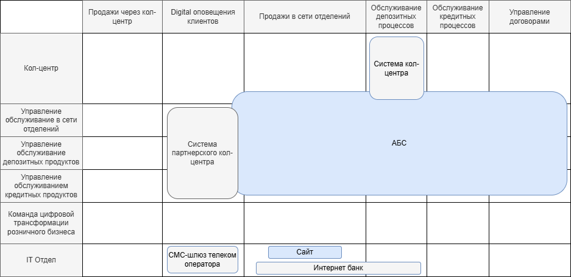
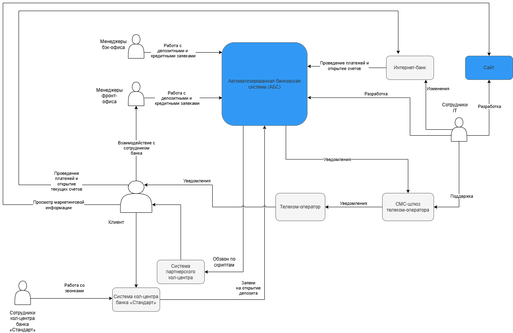

# Карта текущего IT-ландшафта

# Схема интеграции приложений

# Исходные данные для создания карты на основе описания предприятия 

**Сайт**:
 - показ маркетинговой информации

**Интернет-банк**(на платформе подрядчика):
 - проведением платежей 
 - открытие текущих счетов (дебетовых карт)
 - интегрирован с `АБС` — напрямую с её базой данных

**АБС**(Сотрудники в отделениях)
 - учёт операций по счетам и бухгалтерия.
 - отправка СМС-оповещения клиенту на получение депозита с оформлением при визите в банк 
 - обработка заявок из `кол-центра` на получение депозита

**кол-центр** (на платформе подрядчика 1)
 - прием звонков через отдельную систему
 - прием обращений на открытие депозита(сохранение в своей платформе и передача в `АБС`). 

**партнёрский кол-центр**(на платформе подрядчика 2)
 -  работает по готовым скриптам звонков, которые ему передают `бизнес-представители банка`.

**СМС-шлюз** 
 - поддерживает IT-отдел банка, взаимодействуя с телеком-оператором.

**Управление обслуживанием в сети отделений**
 - фронт-офис `АБС`
 - открытие депозитных и накопительных счетов в отделении банка
 - прием заявок на открытие депозита от клиента
 - уведомление бэк-офиса о заявке на депозит
 - запросы в `Управление обслуживанием кредитных продуктов`
 - создание депозита в `АБС`
 - загрузка документов, подписанных клиентом, в `АБС`.

**Управление обслуживанием депозитных продуктов**
 - бэк-офис, специализируется на депозитах. 
 - ответы на запросы фронт-офиса (`Управления обслуживанием в сети отделений`)

**Управление обслуживанием кредитных продуктов**
 - бэк-офис, специализируется на кредитах
 - ответы на запросы бэк-офиса (`Управление обслуживанием депозитных продуктов`)

**Команда цифровой трансформации розничного бизнеса**
