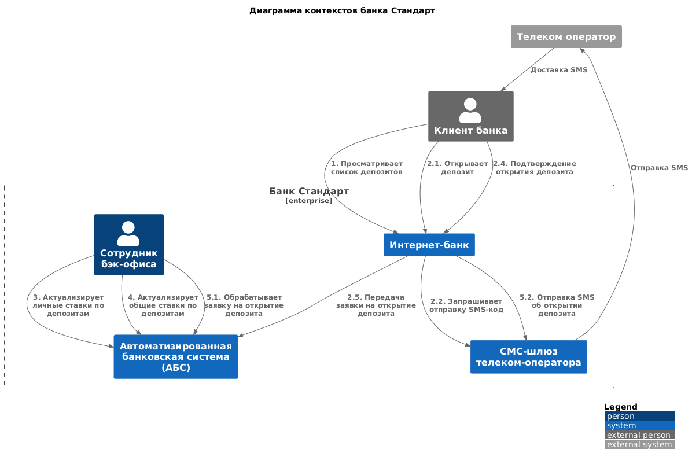
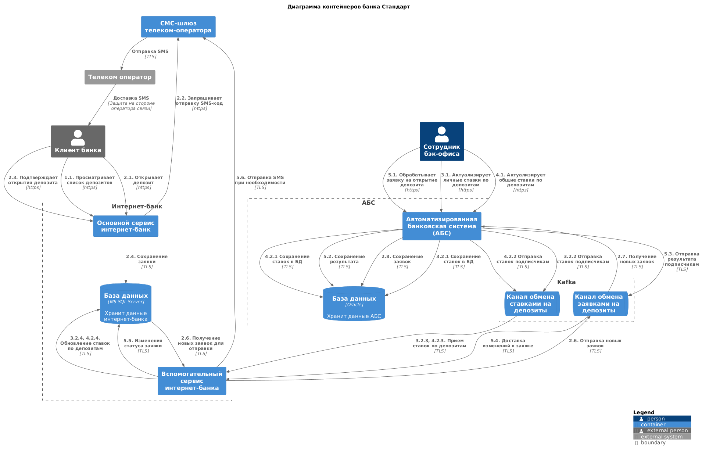

### **Название задачи:** MP-ADR1 MVP Концептуальная архитектура открытия депозитов
 
### **Автор:** 
### **Дата: 23.04.2025** 
### **Функциональные требования**

|**№**|**Действующие лица или системы**|**Use Case**|**Описание**|
| :-: | :-                             | :-         | :-         |
| UC1 | Клиент банка | Просматривает список депозитов | 1. Клиент банка входит в интернет-банк; 2. Клиента банка открывает список доступных депозитов; |
| UC2 | Клиент банка | Открывает депозит | 1. Клиента банка просматривает список доступных депозитов с доступными ставками; 2. Клиент открывает депозит, выбрав счёт и введя сумму депозита; 3. Клиент банка подтверждает открыватие депозита кодом из SMS-сообщения; 4. Заявка на открытие депозита отправляется в АБС и назначается на сотрудника бэк-офиса |
| UC3 | Сотрудник бэк офиса | Актуализирует личные ставки по депозитам | 1. Сотрудник бэк-офиса входит в АБС под личной учеткой; 2. Для каждого клиента актуализирует его личные ставки;  |
| UC4 | Сотрудник бэк офиса | Актуализирует общие ставки по депозитам | 1. Сотрудник бэк-офиса входит в АБС под личной учеткой; 2. Актуализирует общие ставки;  |
| UC5 | Сотрудник бэк офиса | Обрабатывает заявку на открытие депозита | 1. Сотрудник бэк-офиса входит в АБС под личной учеткой; 2. Открывает список заявок, заначенных на него; 3. Обрабатывает необработанные заявки |

### **Нефункциональные требования**
|**№**|**Требование**|
| :-: | :- |
| R  | **Надёжность (Reliability)**                                                                                               |
| R1 | Все сервисы должны работать (отказоустойчивость) 24/7 в 99.9% случаев                                                      |
| P  | **Производительность (Performance)**                                                                                       |
| P1 | Необходимо предусмотреть возможность масштабирования систем банка                                                          |
| P2 | Необходимо предусмотреть возможность балансировки нагрузки между репликами систем банка                                    |
| P3 | Доступность всех сервисов должна быть 24/7 в 99.9% случаев                                                                 |
| +R | **+Ограничения (Restricitions)**                                                                                           |
| R1 | Новый функционал интернет-банка должен разрабатываться на ASP.NET MVC 4.5 с использованием MS SQL                          |
| R2 | Новый функционал АБС должен разрабатываться на Delphi с использованием СУБД Orcale и хранимых процедур                     |
| R3 | Новый функциона call-центра должен разрабатываться: веб-интерфейс на React.js, бэкенд на Java Spring Boot и базы PostgreSQL|
| R4 | Для разработки можно использовать новые технологии при наличии обоснования                                                 |
| R8 | рассылку SMS желательно реализовать силами разработчиков банка                                                             |
| R9 | Процесс согласования заявки желательно реализовать в АБС                                                                   |
| R10| Работу с депозитами желательно реализовать в АБС                                                                           |
| R11| Интернет-банк не должен иметь прямую интеграцию с АБС                                                                      |
| R12| Необходимо добавить шифрование трафика интернет-банка                                                                      |
| R13| АБС может масштабироваться только вертикально                                                                              |
| R14| Невозможно выполнить требования по надежности                                                                              |

### **Решение**

## Диаграмма контекстов

[Редактировать](https://www.plantuml.com/plantuml/uml/fLLTJzDG6BxlhwXSROdR5E76AnGNDG4b0Z5UDTrs0ejTkxHd4M9CnZ0HOnH8I3J6QEOls72LfMpiBxpd7_cyfomh7Q29a8pktNa-tkSy6Gk1j7tPg3d6ZQfRTXeLOMvAMG_k5Wg-_Ig_KPMRZL8Z47xPSwLmPRxirGfrntOPamjanQcM2ejpkHKUhIyl5Mfs88MFaRN8Y2sPhpExiNJlnTFrDUlvuxL7rbBnOV79WqpMC6HLEiAa8-fJXtwf9bu7-EsO5D4P3LMBGehK3lwUqR59NNm-f8W_RsF6RthKKKtLCemLuGUUQnMtPARS2AHN4_vDSuQ-qYd8G-PAu6UonkesZDRqUIaSWRqihovyMteQzvD284FjOs3YPKGX-sChgWcyKSHwVjsl1iAwxpNSYkrlPygt67iOoqoPdCcQhmqJFx7NZAZL7MzR2CQqGTl2eLtg0T1dT5Tzf2Y7-LlggnqshS6nyOnT2XXtGCSwdG5R0-u4PvkSbXOUOhe_sHjZ44LwY0UmweGvy0oO3gcTlIXIvHrT8QsIxRvakI_nfK1YYDTMRanz4HRK0cl3bkUBVQDsJktHgVf49oRGYM1pwM3rbcyCuvbm4jUOjd4xRz8FNXDBwCNntDShmnDlDjA9dN6AFMYDyCZ1w1f1u2_qitaM-8xZ4MxamvWunGKUfac19wk3PXOqdm4UwGNt4XxvjkCnHf7QDLUNLtCwavxclTxU7E_FPq5ohEFxpTvqSK9mZvrp8zH-EeFEvSvreK0-p-IQDDJ5VOTs08dEi5Ngczogb0YhJekmIgBaiS0Tq1y0sKBLEtGwhYpUwLmmWE8GgOUuI2OQgu9xIeG6LydCNIi3XgvwZ-7_YSp7HG4NNsINcvYeooGqjVlleLtRAIZEicAoFE15UVHAQO7-bRSoeRpio-yI_dDdqwUJNxP7q4USAPon8DoA_YVm1m00)

## Схема контейнеров

[Редактировать](https://www.plantuml.com/plantuml/uml/hLVVJoDL57xlNt7bgIHR42XgV75rbsWYkBjMusCpfLUssVweCrEL61Ea4jUWiXeIDyPWCF6zTAaCfPH_uTp_oFETWPrBxz1n4tOpm_JEdEyxvpi_xipT8FJyiDEevrwhDTVhdQfMZyEm7RmzF-zxNyrjrCB7dKedqFvwgndgPZYttchCj-jU4pQ58ApMQvNvUyN2GonzkhOwt_22KFkyLBx75bwjgVsvDZ_xZfVBXRMmhXNjKqGzUc6s-3pY_pr5GnhJkTcc0PtIEGturfZwYewenp-7UEAGx-B7CVNCbjdEvHvgFsWroojVX_drJX2s6jg_esRe3pfZ-07GBFkPsLnfanrhoFEXhckEezngQzyBMsBtDzkSyG5FHefF5-96Zsd7PeljBmdpkj6kjpQrXj4XtzjcTxhirZdJ3fdI_4p30gz_Jv7vJfZVQtMQLS_Vp5TUPwDtwLSwd9bLt-GK_tifKjwh181yHdrGqaYe8pfX6553GZddrRqaBbvcZg4iyWKJGaEHDCz8J3JB_DTuxbVorKev9kC7Uap0wXx7w6RNxCpmZGU-jrxNkA9_80A2CzlMOpHGCJx3Vvkp8bo0pNEe3_aabzk5AtzJegvnLVbD7POhNlC9R0yuZdC49kTJX0MWFe9J5Ds8F0stNDa0z6-CTG5f-NW1UP5oynFY-Tz4r4iNr8dZ9cdNIghqQ5MLjF-bzZCKdk84P4-Y3Hf1USCBBsloJpeicASSsYzqeW2G57PXih05oaxW8cDyw7t-n7EJzQYZEph_1SvbN_FV80oavU0L7sTecoCQeViG-GdgalhmbnSZXLL4E90id21WiylqDv9KTRiLrAQIICNtiabGfH_hkZKg9ZEsCBSmf-WlD1kNWhGVNqTeF8YlK3oe3KOTJX2WN95AcPpCbS6qA4m7R3VasR5xnJ01QWC2Rm8bIJdZBJBUxuno8ObzQdcD0INBef7fgj9QgI2rS6mJP3cy16bWn6XzgPz_wTYca4WmiCpUf3YzZ4ZGFGvXaGanNNVYva2sCTRjeeg0-ybgwHBLXN5c083Vk8pap7JD3mciZ1pqQC8GvvaVtBDKJ6DsUPmUYNaFhg7qRcAzZZw9vLLYm3Ud19812GZ8VWNrrXInNGH0MBjW3B8aDVsCXjmrNRJfrTR5lr0aM60tPR3PJHifL8fJCZHAYiRr6NJSHAbE9-2IlxxYIRoV4hupOG2vwEHe0Wuk7iTpWAE9ugcJ8KqnGnhCC_CZHRSYJF7sXIdUbZ2Jo6xVI1AMxgWY_iJJ6AxJo6LBKoQZAzq98Nn5uPE9Sq17SGFHMI9RDdDM1IoZ0W0kyXrXQx76VZBIJ5Ushuc9IWE7SNeDB7CqDvJ05b-Uc2vUUu23moa1Ptm1SSaTNwbecPNWZBJqGbYMVEpJsDxW5Je7M__Ba4vHoDQUC7Zb6W3LCbCzjv5b6ukPqRHuZqzOikU_lJalfqr-xC9A5Y85HXa1Eo9SHACuQ9j5Q1BGjE-N58RhNhf6rcUJhRHjZhSAp2P9RVB2DMQYCHntFfJa2UgRFPGgFC-LFdZmMNbrvVsLZ-xdPtDtTREAhyt_0000)

#### Шифрование
Для шифрования данных, передаваемых между сервисами, необходимо использовать HTTPS-протокол на TLS 1.3. 

#### Контроль нагрузки
Новые сервисы снабдить метриками контроля нагрузки.

#### Вспомогательный сервис

Поскольку текущая реализация интернет-банка не поддерживает взаимодействие в kafka, предлагается реализовать новый микросервис.
В его функции будет входить:

 - Хранение и отдача предложений по депозитам
 - Получение запросов на депозиты от интернет банка
 - Работа с СМС шлюзом
 - Сохранение результатов выполнения процесса депозитов

Для работы с депозитами предлагается реализовать в АБС новый модуль для взаимодействия с kafka.
В его функции будет входить:

 - Прием заявок на депозиты от менеджеров кол-центра
 - Прием заявок с сайта
 - Прием заявок от ИБ
 - Процесс обновления ставок
 - Процесс расчета персональных ставок
 - Обеспечение работоспособности workflow по депозитам

### **Альтернативы**

**Недостатки, ограничения, риски**

 - Процессы недостаточно автоматизированы и оптимизированы
 - Всё ещё требуется очное присутствие клиента в офисе
 - Многие процессы можно было бы упростить.
 - Нет разделения отвественности с подрядчиком