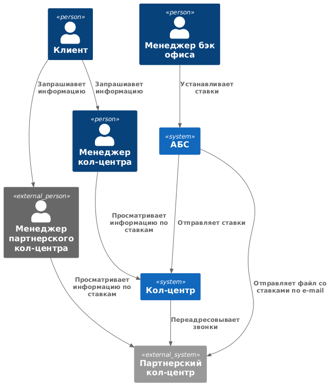
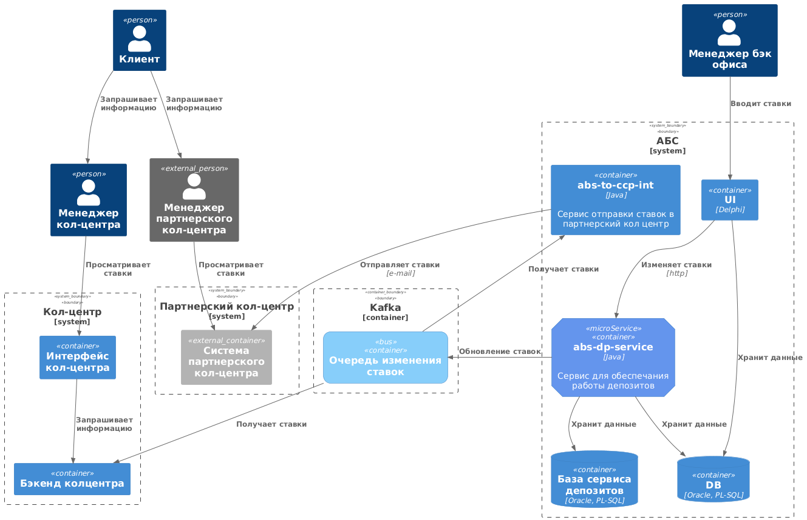

### **Название задачи:** 
### **Автор:**
### **Дата:**
### **Функциональные требования**

|**№**|**Действующие лица или системы**|**Use Case**|**Описание**|
| :-: | :- | :- | :- |
|1|Менеджер бэк офиса, АБС, Система кол-центра             |Передача ставок в кол-центр|1. Менеджер бэк-офиса формирует новые ставки  2. Ставки отправляются в систему кол-центра             |
|2|Менеджер бэк офиса, АБС, Система партнерского кол-центра|Передача ставок в кол-центр|1. Менеджер бэк-офиса формирует новые ставки  2. Ставки отправляются в систему партнерского кол-центра|
|3|Менеджер кол-центра, Клиент, система кол-центра|Консультация по текущим ставкам в кол-центре|1. Клиент звонит в кол-центр, запрашивает текущие ставки по депозитам 2. Менеджер кол-центра смотрит текущие установленные ставки в системе 3. Менеджер передает клиенту информацию |
|4|Менеджер кол-центра, Клиент, система партнерского кол-центра|Консультация по текущим ставкам в партнерском кол-центре|1. Клиент звонит в кол-центр, запрашивает текущие ставки по депозитам 2. Менеджер кол-центра смотрит текущие установленные ставки в системе 3. Менеджер передает клиенту информацию|

### **Нефункциональные требования**

|**№**|**Требование**|
| :-: | :- |
|1|Необходимо использовать партнерский кол-центр|
|2|Партнерский кол-центр может получать данные только в виде файлов|

### **Решение**

 - Силами команды банка доработать АБС для передачи ставок в платформу кол-центра.

 - Поскольку менеджеры партнерского кол-центра не могут взять ставки с сайта, но готовы получать их в виде файлов, то есть такие варианты:

   1. Передача файлов ставок по тем же каналом, которые используются для передачи скриптов звонков
   2. Отправка на e-mail

#### Диаграмма контекста
 

[Редактировать](https://www.plantuml.com/plantuml/uml/jPFDwjD05CNtUOgOLOKMDrsA589BGVG1oZGT93X9GvA2xjfIYY1-k194BE8BnDXgsjhq5UwyaUV6cBID117-YvBft7j-Sy_9P1358eoddZ9kkRwZfcDfthNxT-p-q9xuiN1z6TupZ8SoZ2P-nr6kzEEkQT47Eb16MphgXNMxAaSFX2-Uo90xFd8LlmrzfwsUcRIdd0uzlVgjqZDAAkNm_hCOwg1DVg94p_I2D_6S5xXlbBToEoFXF6s3VjMlQ6zIhfUKWSbAu_7pA9PUHuoYhaLlwHrzncwvwGYbR4G073AuEhXgA-m45xthnlGPxJ1x4_58gZyvrtbQz9uIEh4v_GBIX5A05YQMHyoUe_0JfHLSlBvc1FyFkSmFYN28N_GSHX9OOG1VWnGh1fM5bDsLW49J9y7wJsWgXc2rVjEg3Fv1kiJV7Ht0eFmSbC1DXdk3NTdpXAjAS8riyDVyTcWBwOQVJAHKlwmCqWyiSphMOvxV-IiM23a8Y9JVR1NJt_F6d8tfgnFgxoAuWJECWVJ7Kq-Plm00)

#### Диаграмма контейнеров
 

[Редактировать](https://www.plantuml.com/plantuml/uml/jLLDRnjL5DtxLpn6B1mf5fikCIfnim2AA7LPMszcNknHdcT6Cyzj8eGKGjKY5IXb0wfGeopOEoQcRaqdV-7EF-BSb_77s1CZBB58vkFUS-vvzzmxlfqQcPX1NzVU2q9F3tmbFcpT-g1rgzEAGYE3K2KVrJxs_VdJ0zcjExxhx8htqpW9Z6ewlZJIbQdgf2fvg18EQTLLeVz07Pb5M7Wp3cU7AVUrwglGMCBKH8diAilQax5gtey6eQ_ylUYepS_r7KJSRYlIKT9qTD3jcVRXyPuUMCW1Y8lGenuahVExW_H_u-u7NXArSVJ0Mph0lkK9KAUYI2jAmWCTFLB9ZMLMccYBYFIwYgWhPXSfq-z0KUsUIj8eh7iwWAfTuT1BcjA4nlGkFqLy5lO-bo7Qd736xnp5toNzHUFyHD1RocZQo9zSe_8J6iwHdVqZ0tIy2Nv5m_maF-MNk7vhwVwaR2DltPNUuIRIY_n7UYieon_J19oChBMFKwFwdJrsKIR7TUccZFsPNj2vWpjdHtnT4s8-iPmm213uwXCEtr4wxWKWMadnOnbp5cuRVjmeMis8J-L3oLSwPr4qOYa26gVvSqYZ2nf3sXN-FwKXv4_mca-9G8RpFkFKCU8PlKRi5DSHksjaDssMXwUawOvhLRaiUO_BVv58JwjTSUzke_tbtUfaFsQTBsY8MaC1MNF1UApIiPcMIKq4uuk-cAY1XqOGcflxae7wofv_1Eid484N_92nawEgGPdGcs9Cn69CeEIRMcqkPU6tEs2_FvC7XtBDQiGwYJIAC-WL365XcAVy1u4gh-dlOi2iIoLfpgupSqKqXGCY5h0-RPxKkeKbknxOb-NPXkYo7i-paqU_STYUzp5Itw1FrMjHnl9sM3zv2wpgom9NWbNgZCj2psve-cRzTk_ZsI7EsM0-1jeu_AyB3udtbIul_6mnwHVhmIMFvS8KI0IEGKNUR1te3-P4NKu72hSez8p6YtHUvkqHVhmPioeAqCBbOiBovpHUFGeIUiR4QnNB8qiNA9C1ChsUKXgNfXHeXYz_oMVkd45k1XlW3JSTq15GuygEbhxbyNOCnKzDwJVbLoJPtS-_NqBZzXtcFaE0gP-Wep-jiSJRqZ1FiMV5ncmZPE724ikPNRNlygVLRLW5BZwM_mfbv29zxi2hfM_dz8OXKes-33INlwr2Vz3NuXy0)

### **Альтернативы**
Сменить партнерскийм кол-центр. Он не дает возможности интеграции и развития.

**Недостатки, ограничения, риски**

Репутационные риски из-за задержек в обновлении данных по текущим ставкам в партнерском кол-центре
